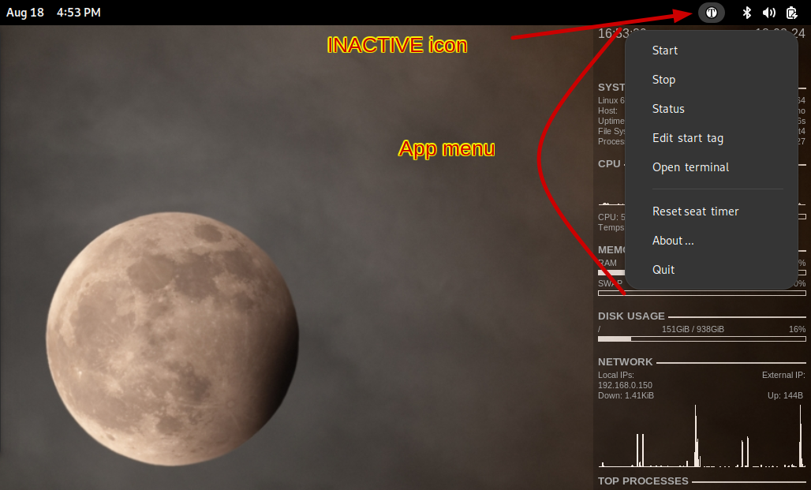

.. class:: title-logobox

.. list-table::
   :widths: 72

   * - |
       |
       |
       | |Addons_logo|

.. |Addons_logo| image:: images/timew.png
   :scale: 512

|
|
|
|

.. class:: title-deepbox

.. list-table::
   :widths: 72

   * - .. class:: title-name

       Software User Manual for
   * - .. class:: title-name

       Timew Status Indicator and Reporting Extensions
   * - .. class:: title-name

       Latest SW release: |swversion|

|
|
|

.. class:: title-info

**Document number:** VCT81443A

.. class:: title-info

**Document revision:** |docrev|

.. class:: title-info

**Document build date:** |date|

|
|
|

.. class:: title-deepbox

.. list-table::
   :widths: 72

   * - .. class:: title-notice

       Distribution Statement A: Approved for public release. Distribution is unlimited.

.. contents:: Table of Contents

.. raw:: pdf

   PageBreak

.. role:: bigtext

:bigtext:`Revisions`

Document revision history.

.. list-table::
   :widths: 8 8 10 45
   :header-rows: 1

   * - Revision
     - Author
     - Date
     - Description
   * - 0.1
     - SLA
     - 2023-08-17
     - Initial draft shell
   * - 0.2
     - SLA
     - 2024-08-18
     - Update system description and replace graphics
   * - 0.3
     - SLA
     - 2024-08-30
     - Update title page and sw version
   * - 0.4
     - SLA
     - 2024-08-31
     - Flesh out sections 2 and 3
   * - 0.5
     - SLA
     - 2024-09-01
     - Switch to secnum directive, make section 3 complete-ish

.. |date| date:: %m-%d-%Y %H:%M
.. |docrev| replace:: 0.5
.. |swversion| replace:: 0.2.1

.. raw:: pdf

   PageBreak

.. section-numbering::
   :depth: 4

.. include:: <isonum.txt>

Scope
=====

Identification
~~~~~~~~~~~~~~

This document is the Software User Manual (see revision table) for the
Timew-Addons package, including the ``timew-status-indicator`` GUI and the
required ``timew`` report extensions. Herein we describe the following
components:

:appindicator: Gtk-based freedesktop_ taskbar/sys-tray GUI
:config.yaml: XDG freedesktop-compliant `user configuration`_
:extensions: timewarrior `report extensions`_

.. _user configuration: https://github.com/sarnold/timew-addons/blob/4659e21a0d75cd6a050488b8096b9a4b54844393/src/timew_status/utils.py#L12
.. _freedesktop: https://www.freedesktop.org/wiki/
.. _report extensions: https://github.com/lauft/timew-report/

System Overview
~~~~~~~~~~~~~~~

The Timew-Addons package includes a configurable status indicator app and
some ``timew`` report extensions for customizing the report output of the
``timew`` command.  The ``timew-status-indicator`` application is a small
Gtk_ Appindicator_ GUI that takes advantage of desktop notifications and
either (legacy) system tray or taskbar applet support in XDG desktops. An
appindicator GUI is typically small, essentially a menu connected to a
variable set of icons (used to show status/state). Figure 1 below shows
the menu and default inactive state icon:

   Figure 1. Gnome desktop appindicator GUI

In the above figure, the ``timew-status-indicator`` is actually running inside
the Gnome Shell Extension appindicator-support_.

.. _Gtk: https://pygobject.gnome.org/tutorials/gtk3.html
.. _Appindicator: https://lazka.github.io/pgi-docs/AyatanaAppIndicator3-0.1/index.html
.. _appindicator-support: https://extensions.gnome.org/extension/615/appindicator-support/

Document Overview
~~~~~~~~~~~~~~~~~

The purpose of this SUM document is to provide a hands-on software user
the basic information required to operate the ``timew-status-indicator``
user interface (GUI) and reporting tools (timew extensions) in the
context of time tracking using the timewarrior_ tool. The content and
format generally follow the SUM Data Item Description (DI-IPSC-81443)
from `this template repository`_.

.. _timewarrior: https://timewarrior.net/docs/
.. _this template repository: https://github.com/VCTLabs/software_user_manual_template

Referenced documents
====================

User component documentation:

* timew-addons: https://sarnold.github.io/timew-addons/
* timew-report: https://github.com/lauft/timew-report/
* timewarrior: https://timewarrior.net/docs/
* gnome extensions: https://extensions.gnome.org/about/
* XDG desktop: https://www.freedesktop.org/wiki/

Software summary
================

This software is primarily a Python_ project and follows current Python
packaging standards such as PEP517_ and still relies on legacy features
to package and install non-python files (eg, icons and .desktop files).

.. _Python: https://docs.python.org/3/contents.html
.. _PEP517: https://peps.python.org/pep-0517/

The primary user-facing file types are:

:desktop file: launcher for ``timew-status-indicator``
:extensions: ``onelineday`` and ``totals``
:icons: ``icons/*.svg,*.png`` files

Software application
~~~~~~~~~~~~~~~~~~~~

Timewarrior is Free and Open Source Software that tracks time from the
command line. The reporting of tracked time intervals is also based on
terminal I/O so the ``timew`` command has an extension interface to load
user scripts to process ``timew`` intervals and emit custom report formats
to ``stdout``.

The report extensions enable custom output formats for both human and
machine consumption, while the status indicator GUI enables monitoring
and control of timewarrior tracking intervals with configurable "work day"
and "seat" timers. Alerts and menu feedback are provided via icon changes
and/or desktop notification bubbles using a "stoplight" metaphor on top
of the built-in Python log levels and Gnome symbolic indicator icons:
INFO, WARNING, ERROR.

Software inventory
~~~~~~~~~~~~~~~~~~

Regardless of packaging tools, the installed files can be listed using the
"native" packaging tools as shown in the section below.

Quick start install
-------------------

The appindicator GUI prefers OS package manager over virtual environment
install due to the icon/desktop file integration with an XDG-compliant
desktop, eg, Gnome or XFCE.  While the extension scripts should work
anywhere ``timew`` can be installed, running the appindicator GUI requires
a real XDG desktop environment, meaning Linux or some other POSIX environment
with Gtk+ and all the other desktop bits.

That said, the GUI script should still run from a local Python virtual
environment, albeit with a fallback set of icons.

* if on Gentoo, add `this portage overlay`_ and install ``timew-addons``
* if on recent Ubuntu LTS, add `this PPA`_ and install ``timew-addons``

Install with package manager
++++++++++++++++++++++++++++

OS packages are deployed via multiple methods, including GH release pages
and package overlays for Gentoo_ and Ubuntu_.

Installing using system package manager is currently only supported on
Gentoo_ and requires `this portage overlay`_. Use one of the overlay
install methods shown in the readme_ file and sync the overlay; following
the overlay sync, install the package and dependencies::

  $ sudo emerge timew-addons -v --ask

When available, use the following `Ubuntu PPA`_ to install on at least
Focal and Jammy.  Make sure you have the ``add-apt-repository`` command
installed and then add the PPA:

::

  $ sudo apt-get install software-properties-common
  $ sudo add-apt-repository -y -s ppa:nerdboy/embedded
  $ sudo apt-get install timew-addons

See `Adding this PPA to your system`_ for more info.

.. _Adding this PPA to your system:
.. _this PPA:
.. _Ubuntu PPA: https://launchpad.net/~nerdboy/+archive/ubuntu/embedded
.. _Gentoo: https://www.gentoo.org/
.. _readme:
.. _this portage overlay: https://github.com/VCTLabs/embedded-overlay/

Package listings
----------------

Using Gentoo's ``app-portage/portage-utils``::

   user@gentoo timew-addons $ qlist timew-addons
   /usr/share/timew-addons/extensions/totals.py
   /usr/share/timew-addons/extensions/onelineday.py
   /usr/share/timew-addons/extensions/csv_rpt.py
   /usr/share/doc/timew-addons-0.2.1/README.rst.bz2
   /usr/share/applications/timew-status-indicator.desktop
   /usr/share/icons/hicolor/scalable/status/timew_info.svg
   /usr/share/icons/hicolor/scalable/status/timew_warning.svg
   /usr/share/icons/hicolor/scalable/status/timew_inactive.svg
   /usr/share/icons/hicolor/scalable/status/timew_error.svg
   /usr/share/icons/hicolor/scalable/apps/timew.svg
   /usr/share/icons/hicolor/48x48/apps/timew.png
   /usr/bin/timew-status-indicator
   /usr/lib/python3.11/site-packages/timew_status/__pycache__/__init__.cpython-311.opt-1.pyc
   /usr/lib/python3.11/site-packages/timew_status/__pycache__/utils.cpython-311.opt-1.pyc
   /usr/lib/python3.11/site-packages/timew_status/__pycache__/__init__.cpython-311.opt-2.pyc
   /usr/lib/python3.11/site-packages/timew_status/__pycache__/utils.cpython-311.opt-2.pyc
   /usr/lib/python3.11/site-packages/timew_status/__pycache__/__init__.cpython-311.pyc
   /usr/lib/python3.11/site-packages/timew_status/__pycache__/utils.cpython-311.pyc
   /usr/lib/python3.11/site-packages/timew_status/utils.py
   /usr/lib/python3.11/site-packages/timew_status/__init__.py
   /usr/lib/python3.11/site-packages/timew_addons-0.2.1.dist-info/top_level.txt
   /usr/lib/python3.11/site-packages/timew_addons-0.2.1.dist-info/WHEEL
   /usr/lib/python3.11/site-packages/timew_addons-0.2.1.dist-info/METADATA
   /usr/lib/python-exec/python3.11/timew-status-indicator

Using ``dpkg`` on Ubuntu *focal*::

   ubuntu@arm:~$ dpkg -L timew-addons
   /.
   /usr
   /usr/bin
   /usr/bin/timew-status-indicator
   /usr/lib
   /usr/lib/python3
   /usr/lib/python3/dist-packages
   /usr/lib/python3/dist-packages/timew_addons-0.1.1.egg-info
   /usr/lib/python3/dist-packages/timew_addons-0.1.1.egg-info/PKG-INFO
   /usr/lib/python3/dist-packages/timew_addons-0.1.1.egg-info/dependency_links.txt
   /usr/lib/python3/dist-packages/timew_addons-0.1.1.egg-info/requires.txt
   /usr/lib/python3/dist-packages/timew_addons-0.1.1.egg-info/top_level.txt
   /usr/lib/python3/dist-packages/timew_status
   /usr/lib/python3/dist-packages/timew_status/__init__.py
   /usr/lib/python3/dist-packages/timew_status/utils.py
   /usr/lib/timew-addons
   /usr/lib/timew-addons/extensions
   /usr/lib/timew-addons/extensions/csv_rpt.py
   /usr/lib/timew-addons/extensions/onelineday.py
   /usr/lib/timew-addons/extensions/totals.py
   /usr/share
   /usr/share/applications
   /usr/share/applications/timew-status-indicator.desktop
   /usr/share/doc
   /usr/share/doc/timew-addons
   /usr/share/doc/timew-addons/changelog.Debian.gz
   /usr/share/doc/timew-addons/copyright
   /usr/share/icons
   /usr/share/icons/hicolor
   /usr/share/icons/hicolor/48x48
   /usr/share/icons/hicolor/48x48/apps
   /usr/share/icons/hicolor/48x48/apps/timew.png
   /usr/share/icons/hicolor/scalable
   /usr/share/icons/hicolor/scalable/apps
   /usr/share/icons/hicolor/scalable/apps/timew.svg
   /usr/share/icons/hicolor/scalable/status
   /usr/share/icons/hicolor/scalable/status/timew_error.svg
   /usr/share/icons/hicolor/scalable/status/timew_inactive.svg
   /usr/share/icons/hicolor/scalable/status/timew_info.svg
   /usr/share/icons/hicolor/scalable/status/timew_warning.svg
   /usr/share/python3
   /usr/share/python3/runtime.d
   /usr/share/python3/runtime.d/timew-addons.rtupdate

While not recommended for normal use, it does work using pip_ in a
virtual_environment_ **if** all the native (non-python) deps are
installed::

   (venv) user@host timew-addons $ python -m pip show -f timew-addons
   Name: timew-addons
   Version: 0.2.2.dev4+g5e4f985
   Summary: A collection of timewarrior extensions and experiments
   Home-page: https://github.com/sarnold/timew-addons
   Author: Stephen L Arnold
   Author-email: nerdboy@gentoo.org
   License: GPLv3+
   Location: /home/nerdboy/src/timew-addons/.tox/py/lib/python3.11/site-packages
   Requires: munch, pycairo, PyGObject, timew-report
   Required-by:
   Files:
     ../../../bin/timew-status-indicator
     ../../../share/applications/timew-status-indicator.desktop
     ../../../share/icons/hicolor/48x48/apps/timew.png
     ../../../share/icons/hicolor/scalable/apps/timew.svg
     ../../../share/icons/hicolor/scalable/status/timew_error.svg
     ../../../share/icons/hicolor/scalable/status/timew_inactive.svg
     ../../../share/icons/hicolor/scalable/status/timew_info.svg
     ../../../share/icons/hicolor/scalable/status/timew_warning.svg
     ../../../share/timew-addons/extensions/__pycache__/csv_rpt.cpython-311.pyc
     ../../../share/timew-addons/extensions/__pycache__/onelineday.cpython-311.pyc
     ../../../share/timew-addons/extensions/__pycache__/totals.cpython-311.pyc
     ../../../share/timew-addons/extensions/csv_rpt.py
     ../../../share/timew-addons/extensions/onelineday.py
     ../../../share/timew-addons/extensions/totals.py
     timew_addons-0.2.2.dev4+g5e4f985.dist-info/INSTALLER
     timew_addons-0.2.2.dev4+g5e4f985.dist-info/METADATA
     timew_addons-0.2.2.dev4+g5e4f985.dist-info/RECORD
     timew_addons-0.2.2.dev4+g5e4f985.dist-info/REQUESTED
     timew_addons-0.2.2.dev4+g5e4f985.dist-info/WHEEL
     timew_addons-0.2.2.dev4+g5e4f985.dist-info/direct_url.json
     timew_addons-0.2.2.dev4+g5e4f985.dist-info/top_level.txt
     timew_status/__init__.py
     timew_status/__pycache__/__init__.cpython-311.pyc
     timew_status/__pycache__/utils.cpython-311.pyc
     timew_status/utils.py

User-installed/modifyable files
-------------------------------

Runtime requires thedesktop user to perform post-install of extension
modules. What this means is, *you* (the user) must manully installed
the staged extension files into the ``$HOME`` path shown in section
`Software organization and overview of operation`_. This can be done
either from GUI menu or by copying the files manually. Use the config
file to change the path in ``extensions_dir`` *only if necessary*.

.. _pip: https://pip.pypa.io/en/stable/
.. _virtual_environment: https://packaging.python.org/en/latest/guides/installing-using-pip-and-virtual-environments/

Software environment
~~~~~~~~~~~~~~~~~~~~

The base environment is essentially the standard Linux/Unix host requirements for
running an XDG-compliant desktop environment based on Gtk_ (and related dependencies).
There are no specific SW requirements beyond the normal user with ``sudo`` access
to install software. The primary supported Linux distributions are Gentoo
and Ubuntu 20.04 or 22.04 LTS.

The minimum required hardware to run a compliant desktop is sufficient for the GUI,
but the report extensions should run in any modern console environment where
timewarrior can be installed.

See Section 6.x Development Environments regarding alternate Linux distributions
that have been tested.

Software dependencies
---------------------

Dependencies can be found in specific packaging artifacts for each environment:

* Base packages for Python_ - munch, pycairo, PyGObject, timew-report
* Base packages for Gentoo_ and Ubuntu_ - the above Python packages, plus
  non-python libraries for libayatana-appindicator, libnotify, and libgtk+v3
* Additional packages - some environments may also need hicolor-icon-theme
  or gnome-shell-extension-appindicator

.. _Ubuntu: https://ubuntu.com/
.. _Debian: https://www.debian.org/
.. _Gentoo: https://www.gentoo.org/

Software organization and overview of operation
~~~~~~~~~~~~~~~~~~~~~~~~~~~~~~~~~~~~~~~~~~~~~~~

The logical user-facing components of the software are shown below:

* **Timew Status Indicator** - selected from the Applications View or the Utils menu
  in an XDG-compliant desktop
* **XDG-user configuration** - created in XDG config directory::

    $HOME/.config/timew_status_indicator/config.yaml

* **Report extensions** - "staged" by package install, requires install by
  user into timewarrior extensions directory::

    $HOME/.timewarrior/extensions

Assistance and problem reporting
~~~~~~~~~~~~~~~~~~~~~~~~~~~~~~~~

Please use the lovely GitHub_ features to submit Pull Requests or report
problems. For software problems, use the Addons_ issue tracker; for documentation
problems/corrections, use the Addons-SUM_ issue tracker. If unsure, feel
free to open a Discussion_ topic instead.

.. _GitHub: https://github.com/features
.. _Addons: https://github.com/sarnold/timew-addons/issues
.. _Addons-SUM: https://github.com/sarnold/timew-addons-sum/issues
.. _Discussion: https://github.com/sarnold/timew-addons/discussions

Access to the software
======================

This section shall contain step-by-step procedures oriented to the first
time/occasional user. Enough detail shall be presented so that the user
can reliably access the software before learning the details of its
functional capabilities. Safety precautions, marked by WARNING or
CAUTION, shall be included where applicable.

First-time user of the software
~~~~~~~~~~~~~~~~~~~~~~~~~~~~~~~

This paragraph shall be divided into the following subparagraphs.

Equipment familiarization
-------------------------

This paragraph shall describe the following as appropriate:

a. Procedures for turning on power and making adjustments
b. Dimensions and capabilities of the visual display screen
c. Appearance of the cursor, how to identify an active cursor if more than
   one cursor can appear, how to position a cursor, and how to use a cursor
d. Keyboard layout and role of different types of keys and pointing devices
e. Procedures for turning power off if special sequencing of operations is needed

Access control
--------------

This paragraph shall present an overview of the access and security
features of the software that are visible to the user. The following
items shall be included, as applicable:

a. How and from whom to obtain a password
b. How to add, delete, or change passwords under user control
c. Security and privacy considerations pertaining to the storage and
   marking of output reports and other media that the user will generate

Installation and setup
----------------------

This paragraph shall describe any procedures that the user must perform
to be identified or authorized to access or install software on the
equipment, to perform the installation, to configure the software, to
delete or overwrite former files or data, and to enter parameters for
software operation.

Initiating a session
~~~~~~~~~~~~~~~~~~~~

This paragraph shall provide step-by-step procedures for beginning work,
including any options available. A checklist for problem determination
shall be included in case difficulties are encountered.

Stopping and suspending work
~~~~~~~~~~~~~~~~~~~~~~~~~~~~

This paragraph shall describe how the user can cease or interrupt use of
the software and how to determine whether normal termination or
cessation has occurred.

Processing reference guide
==========================

This section shall provide the user with procedures for using the
software. If procedures are complicated or extensive, additional
Sections 6, 7, etc, may be added in the same paragraph structure as this
section and with titles meaningful to the sections selected. The
organization of the document will depend on the characteristics of the
software being documented. For example, one approach is to base the
sections on the organizations in which users work, their assigned
positions, their work sites, or the tasks they must perform. For other
software, it may be more appropriate to have Section 5 be a guide to
menus, Section 6 be a guide to the command language used, and Section 7
be a guide to functions. Detailed procedures are intended to be
presented in subparagraphs of paragraph 5.3. Depending on the design of
the software, the subparagraphs might be organized on a
function-by-function, menu-by-menu, transaction-by-transaction, or other
basis. Safety precautions, marked by WARNING or CAUTION, shall be
included where applicable.

Capabilities
~~~~~~~~~~~~

This paragraph shall briefly describe the interrelationships of the
transactions, menus, functions, or other processes in order to provide
an overview of the use of the software.

Conventions
~~~~~~~~~~~

This paragraph shall describe any conventions used by the software, such
as the use of colors in displays, the use of audible alarms, the use of
abbreviated vocabulary, and the use of rules for assigning names or codes.

Processing procedures
~~~~~~~~~~~~~~~~~~~~~

This paragraph shall explain the organization of subsequent paragraphs,
e.g., by function, by menu, by screen. Any necessary order in which
procedures must be accomplished shall be described.

Aspect of software use (5.3.x)
------------------------------

The title of this paragraph shall identify the function, menu,
transaction, or other process being described. This paragraph shall
describe and give options and examples, as applicable, of menus,
graphical icons, data entry forms, user inputs, inputs from other
software or hardware that may affect the software’s interface with the
user, outputs, diagnostic or error messages or alarms, and help
facilities that can provide on-line descriptive or tutorial information.
The format for presenting this information can be adapted to the
particular characteristics of the software, but a consistent style of
presentation shall be used, i.e., the descriptions of menus shall be
consistent, the descriptions of transactions shall be consistent among
themselves.

Related processing
~~~~~~~~~~~~~~~~~~

This paragraph shall identify and describe any related batch, offline,
or background processing performed by the software that is not invoked
directly by the user and is not described in paragraph 5.3. Any user
responsibilities to support this processing shall be specified.

Data backup
~~~~~~~~~~~

This paragraph shall describe procedures for creating and retaining
backup data that can be used to replace primary copies of data in event
of errors, defects, malfunctions, or accidents.

Recovery from errors, malfunctions, and emergencies
~~~~~~~~~~~~~~~~~~~~~~~~~~~~~~~~~~~~~~~~~~~~~~~~~~~

This paragraph shall present detailed procedures for restart or recovery
from errors or malfunctions occurring during processing and for ensuring
continuity of operations in the event of emergencies.

Messages
~~~~~~~~

This paragraph shall list, or refer to an appendix that lists, all error
messages, diagnostic messages, and information messages that can occur
while accomplishing any of the user’s functions. The meaning of each
message and the action that should be taken after each such message
shall be identified and described.

Quick-reference guide
~~~~~~~~~~~~~~~~~~~~~

If appropriate to the software, this paragraph shall provide or
reference a quick-reference card or page for using the software. This
quick-reference guide shall summarize, as applicable, frequently-used
function keys, control sequences, formats, commands, or other aspects of
software use.

Notes
=====

This section shall contain any general information that aids in understanding
this document (e.g., background information, glossary, rationale). This
section shall include an alphabetical listing of all acronyms, abbreviations,
and their meanings as used in this document and a list of terms and
definitions needed to understand this document.

Acronyms and abbreviations
~~~~~~~~~~~~~~~~~~~~~~~~~~

The following may be used in this document to describe specific technologies
or engineering processes.

:COTS: Commercial-Off-The-Shelf
:CSCI: Computer Software Configuration Item
:FPGA: Field-programmable gate array
:FW: Firmware
:GUI: Graphical User INterface
:HW: Hardware
:ID: Project-unique identifier
:PR: Pull Request (agile code review/quality check workflow step)
:RAM: Reliability, Availability, and Maintainability (aka RMA)
:RC: Release Candidate (SW and FW)
:STD: Software Test Description
:STR: Software Test Report
:SUM: Software User Manual
:SUT: System Under Test
:SVD: Software Version Description
:SW: Software

Appendices
==========

Appendices are strictly optional; if used they should be lettered A, B,
C, and so on.
