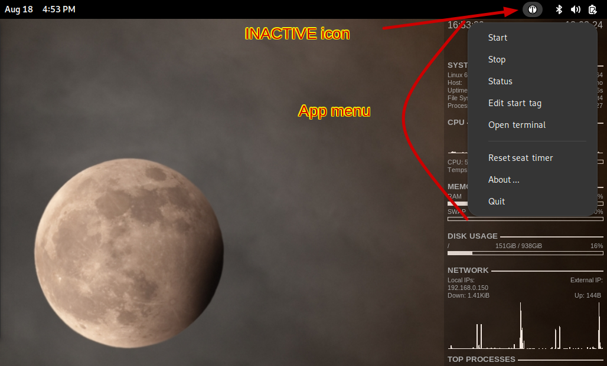
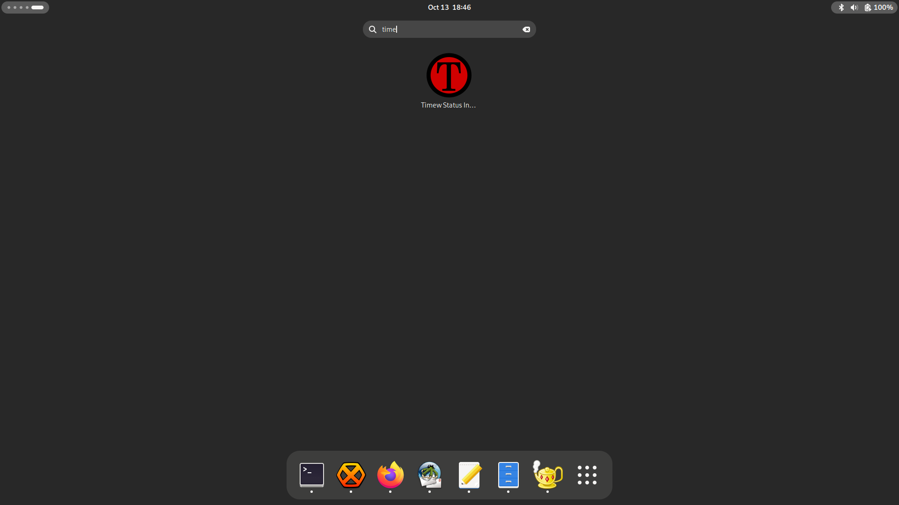
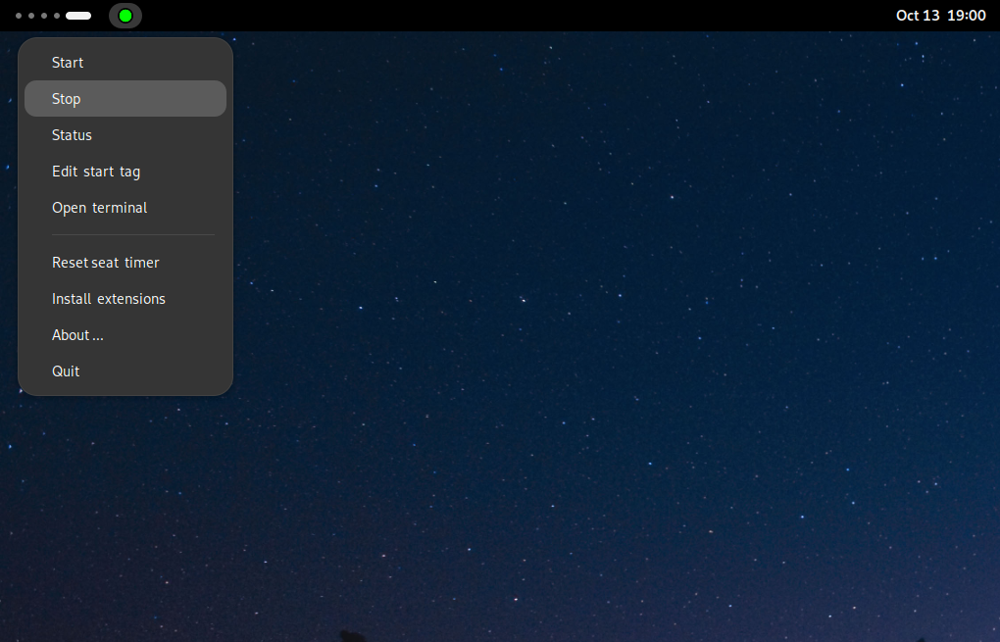
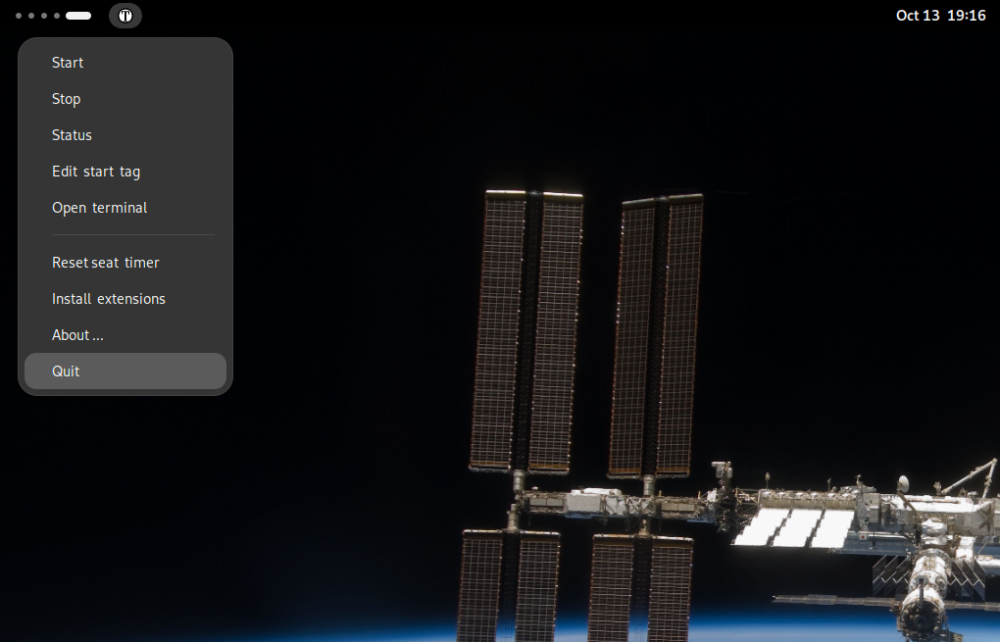

.. class:: title-logobox

.. list-table::
   :widths: 72

   * - |
       |
       |
       | |Addons_logo|

|
|
|
|

.. class:: title-deepbox

.. list-table::
   :widths: 72

   * - .. class:: title-name

       Software User Manual for
   * - .. class:: title-name

       Timew Status Indicator and Reporting Extensions
   * - .. class:: title-name

       Latest SW release: |swversion|

|
|
|

.. class:: title-info

**Document number:** VCT81443A

.. class:: title-info

**Document revision:** |docrev|

.. class:: title-info

**Document build date:** |date|

|
|
|

.. class:: title-deepbox

.. list-table::
   :widths: 72

   * - .. class:: title-notice

       Distribution Statement A: Approved for public release. Distribution is unlimited.

.. contents:: Table of Contents

.. raw:: pdf

   PageBreak

.. role:: bigtext

:bigtext:`Revisions`

Document revision history.

.. list-table::
   :widths: 8 8 10 45
   :header-rows: 1

   * - Revision
     - Author
     - Date
     - Description
   * - 0.1
     - SLA
     - 2023-08-17
     - Initial draft shell
   * - 0.2
     - SLA
     - 2024-08-18
     - Update system description and replace graphics
   * - 0.3
     - SLA
     - 2024-08-30
     - Update title page and sw version
   * - 0.4
     - SLA
     - 2024-08-31
     - Flesh out sections 2 and 3
   * - 0.5
     - SLA
     - 2024-09-01
     - Switch to secnum directive, make section 3 complete-ish
   * - 0.6
     - SLA
     - 2024-10-13
     - Update sections 3 and 4, add more screenshots
   * - 0.7
     - SLA
     - 2025-07-04
     - Update versions for trimmed draft release

.. |date| date:: %m-%d-%Y %H:%M
.. |docrev| replace:: 0.7
.. |swversion| replace:: 0.3.3

.. raw:: pdf

   PageBreak

.. section-numbering::
   :depth: 4

.. include:: <isonum.txt>

Scope
=====

Identification
~~~~~~~~~~~~~~

This document is the Software User Manual (see revision table) for the
timew-addons package, including the ``timew-status-indicator`` GUI and the
required ``timew`` report extensions. This manual describes the following
components:

:appindicator: Gtk-based freedesktop_ taskbar/sys-tray GUI
:config.yaml: XDG freedesktop-compliant `user configuration`_
:extensions: timewarrior `report extensions`_

.. _user configuration: https://github.com/sarnold/timew-addons/blob/4659e21a0d75cd6a050488b8096b9a4b54844393/src/timew_status/utils.py#L12
.. _freedesktop: https://www.freedesktop.org/wiki/
.. _report extensions: https://github.com/lauft/timew-report/

System Overview
~~~~~~~~~~~~~~~

The Timew-Addons package includes a configurable status indicator app and
some ``timew`` report extensions for customizing the report output of the
``timew`` command.  The ``timew-status-indicator`` application is a small
Gtk_ Appindicator_ GUI that takes advantage of desktop notifications and
either (legacy) system tray or taskbar applet support in XDG desktops. An
appindicator GUI is typically small, essentially a menu connected to a
variable set of icons (used to show status/state). Figure 1 below shows
the menu and default inactive state icon:

   Figure 1. Gnome desktop appindicator GUI

In the above figure, the ``timew-status-indicator`` is actually running inside
the Gnome Shell Extension appindicator-support_.

.. _Gtk: https://pygobject.gnome.org/tutorials/gtk3.html
.. _Appindicator: https://lazka.github.io/pgi-docs/AyatanaAppIndicator3-0.1/index.html
.. _appindicator-support: https://extensions.gnome.org/extension/615/appindicator-support/

Document Overview
~~~~~~~~~~~~~~~~~

The purpose of this SUM document is to provide a hands-on software user
the basic information required to operate the ``timew-status-indicator``
user interface (GUI) and reporting tools (timew extensions) in the
context of time tracking using the timewarrior_ tool. The content and
format generally follow the SUM Data Item Description (DI-IPSC-81443)
from `this template repository`_.

.. _timewarrior: https://timewarrior.net/docs/
.. _this template repository: https://github.com/VCTLabs/software_user_manual_template

Referenced documents
====================

User component documentation:

* timew-addons: https://sarnold.github.io/timew-addons/
* timew-report: https://github.com/lauft/timew-report/
* timewarrior: https://timewarrior.net/docs/
* gnome extensions: https://extensions.gnome.org/about/
* XDG desktop: https://www.freedesktop.org/wiki/

Software summary
================

This software is primarily a Python_ project and follows current Python
packaging standards such as PEP517_ but still relies on legacy features
to package and install non-python files (eg, icons and .desktop files).

.. _Python: https://docs.python.org/3/contents.html
.. _PEP517: https://peps.python.org/pep-0517/

The primary user-facing file types are:

:desktop file: launcher for ``timew-status-indicator``
:extensions: ``onelineday`` and ``totals``
:icons: ``icons/*.svg,*.png`` files

Software application
~~~~~~~~~~~~~~~~~~~~

Timewarrior is Free and Open Source Software that tracks time from the
command line. The reporting of tracked time intervals is also based on
terminal I/O so the ``timew`` command has an extension interface to load
user scripts to process ``timew`` intervals and emit custom report formats
to ``stdout``.

The timew-addons report extensions enable custom output formats for both
human and machine consumption, while the status indicator GUI enables
monitoring and control of Timewarrior tracking intervals with
configurable "work day" and "seat" timers. Alerts and menu feedback are
provided via icon changes and/or desktop notification bubbles using a
"stoplight" metaphor on top of the built-in Python log levels and Gnome
symbolic indicator icons: INFO, WARNING, ERROR.

Software inventory
~~~~~~~~~~~~~~~~~~

Regardless of packaging tools, the installed files can be listed using the
"native" packaging tools as shown in the section below.

Package listings
----------------

Using Gentoo's ``app-portage/portage-utils``::

   user@gentoo timew-addons $ qlist timew-addons
   /usr/share/timew-addons/extensions/totals.py
   /usr/share/timew-addons/extensions/onelineday.py
   /usr/share/timew-addons/extensions/csv_rpt.py
   /usr/share/doc/timew-addons-0.2.1/README.rst.bz2
   /usr/share/applications/timew-status-indicator.desktop
   /usr/share/icons/hicolor/scalable/status/timew_info.svg
   /usr/share/icons/hicolor/scalable/status/timew_warning.svg
   /usr/share/icons/hicolor/scalable/status/timew_inactive.svg
   /usr/share/icons/hicolor/scalable/status/timew_error.svg
   /usr/share/icons/hicolor/scalable/apps/timew.svg
   /usr/share/icons/hicolor/48x48/apps/timew.png
   /usr/bin/timew-status-indicator
   /usr/lib/python3.11/site-packages/timew_status/__pycache__/__init__.cpython-311.opt-1.pyc
   /usr/lib/python3.11/site-packages/timew_status/__pycache__/utils.cpython-311.opt-1.pyc
   /usr/lib/python3.11/site-packages/timew_status/__pycache__/__init__.cpython-311.opt-2.pyc
   /usr/lib/python3.11/site-packages/timew_status/__pycache__/utils.cpython-311.opt-2.pyc
   /usr/lib/python3.11/site-packages/timew_status/__pycache__/__init__.cpython-311.pyc
   /usr/lib/python3.11/site-packages/timew_status/__pycache__/utils.cpython-311.pyc
   /usr/lib/python3.11/site-packages/timew_status/utils.py
   /usr/lib/python3.11/site-packages/timew_status/__init__.py
   /usr/lib/python3.11/site-packages/timew_addons-0.2.1.dist-info/top_level.txt
   /usr/lib/python3.11/site-packages/timew_addons-0.2.1.dist-info/WHEEL
   /usr/lib/python3.11/site-packages/timew_addons-0.2.1.dist-info/METADATA
   /usr/lib/python-exec/python3.11/timew-status-indicator

Using ``dpkg`` on Ubuntu *focal*::

   ubuntu@arm:~$ dpkg -L timew-addons
   /.
   /usr
   /usr/bin
   /usr/bin/timew-status-indicator
   /usr/lib
   /usr/lib/python3
   /usr/lib/python3/dist-packages
   /usr/lib/python3/dist-packages/timew_addons-0.1.1.egg-info
   /usr/lib/python3/dist-packages/timew_addons-0.1.1.egg-info/PKG-INFO
   /usr/lib/python3/dist-packages/timew_addons-0.1.1.egg-info/dependency_links.txt
   /usr/lib/python3/dist-packages/timew_addons-0.1.1.egg-info/requires.txt
   /usr/lib/python3/dist-packages/timew_addons-0.1.1.egg-info/top_level.txt
   /usr/lib/python3/dist-packages/timew_status
   /usr/lib/python3/dist-packages/timew_status/__init__.py
   /usr/lib/python3/dist-packages/timew_status/utils.py
   /usr/lib/timew-addons
   /usr/lib/timew-addons/extensions
   /usr/lib/timew-addons/extensions/csv_rpt.py
   /usr/lib/timew-addons/extensions/onelineday.py
   /usr/lib/timew-addons/extensions/totals.py
   /usr/share
   /usr/share/applications
   /usr/share/applications/timew-status-indicator.desktop
   /usr/share/doc
   /usr/share/doc/timew-addons
   /usr/share/doc/timew-addons/changelog.Debian.gz
   /usr/share/doc/timew-addons/copyright
   /usr/share/icons
   /usr/share/icons/hicolor
   /usr/share/icons/hicolor/48x48
   /usr/share/icons/hicolor/48x48/apps
   /usr/share/icons/hicolor/48x48/apps/timew.png
   /usr/share/icons/hicolor/scalable
   /usr/share/icons/hicolor/scalable/apps
   /usr/share/icons/hicolor/scalable/apps/timew.svg
   /usr/share/icons/hicolor/scalable/status
   /usr/share/icons/hicolor/scalable/status/timew_error.svg
   /usr/share/icons/hicolor/scalable/status/timew_inactive.svg
   /usr/share/icons/hicolor/scalable/status/timew_info.svg
   /usr/share/icons/hicolor/scalable/status/timew_warning.svg
   /usr/share/python3
   /usr/share/python3/runtime.d
   /usr/share/python3/runtime.d/timew-addons.rtupdate

While not recommended for normal use, it does work using pip_ in a
virtual_environment_ **if** all the native (non-python) deps are
installed::

   (venv) user@host timew-addons $ python -m pip show -f timew-addons
   Name: timew-addons
   Version: 0.2.2.dev4+g5e4f985
   Summary: A collection of timewarrior extensions and experiments
   Home-page: https://github.com/sarnold/timew-addons
   Author: Stephen L Arnold
   Author-email: nerdboy@gentoo.org
   License: GPLv3+
   Location: /home/nerdboy/src/timew-addons/.tox/py/lib/python3.11/site-packages
   Requires: munch, pycairo, PyGObject, timew-report
   Required-by:
   Files:
     ../../../bin/timew-status-indicator
     ../../../share/applications/timew-status-indicator.desktop
     ../../../share/icons/hicolor/48x48/apps/timew.png
     ../../../share/icons/hicolor/scalable/apps/timew.svg
     ../../../share/icons/hicolor/scalable/status/timew_error.svg
     ../../../share/icons/hicolor/scalable/status/timew_inactive.svg
     ../../../share/icons/hicolor/scalable/status/timew_info.svg
     ../../../share/icons/hicolor/scalable/status/timew_warning.svg
     ../../../share/timew-addons/extensions/__pycache__/csv_rpt.cpython-311.pyc
     ../../../share/timew-addons/extensions/__pycache__/onelineday.cpython-311.pyc
     ../../../share/timew-addons/extensions/__pycache__/totals.cpython-311.pyc
     ../../../share/timew-addons/extensions/csv_rpt.py
     ../../../share/timew-addons/extensions/onelineday.py
     ../../../share/timew-addons/extensions/totals.py
     timew_addons-0.2.2.dev4+g5e4f985.dist-info/INSTALLER
     timew_addons-0.2.2.dev4+g5e4f985.dist-info/METADATA
     timew_addons-0.2.2.dev4+g5e4f985.dist-info/RECORD
     timew_addons-0.2.2.dev4+g5e4f985.dist-info/REQUESTED
     timew_addons-0.2.2.dev4+g5e4f985.dist-info/WHEEL
     timew_addons-0.2.2.dev4+g5e4f985.dist-info/direct_url.json
     timew_addons-0.2.2.dev4+g5e4f985.dist-info/top_level.txt
     timew_status/__init__.py
     timew_status/__pycache__/__init__.cpython-311.pyc
     timew_status/__pycache__/utils.cpython-311.pyc
     timew_status/utils.py

User-installed/modifiable files
-------------------------------

Runtime requires the desktop user to perform post-install of extension modules.
What this means is, *you* (the user) must manually installed the staged
extension files into the ``$HOME`` path shown in section `Software organization
and overview of operation`_. This can be done either from GUI menu or by copying
the files manually. Use the configuration file to change the path in
``extensions_dir`` *only if necessary*.

.. _pip: https://pip.pypa.io/en/stable/
.. _virtual_environment: https://packaging.python.org/en/latest/guides/installing-using-pip-and-virtual-environments/

Software environment
~~~~~~~~~~~~~~~~~~~~

The base environment is essentially the standard Linux/Unix host requirements for
running an XDG-compliant desktop environment based on Gtk_ (and related dependencies).
There are no specific SW requirements beyond the normal user with ``sudo`` access
to install software. The primary supported Linux distributions are Gentoo
and Ubuntu 20.04 or 22.04 LTS.

The minimum required hardware to run a compliant desktop is sufficient for the GUI,
but the report extensions should run in any modern console environment where
timewarrior can be installed.

See Section 6.x Development Environments regarding alternate Linux distributions
that have been tested.

Software dependencies
---------------------

Dependencies can be found in specific packaging artifacts for each environment:

* Base packages for Python_ - munch, pycairo, PyGObject, timew-report
* Base packages for Gentoo_ and Ubuntu_ - the above Python packages, plus
  non-python libraries for libayatana-appindicator, libnotify, and libgtk+v3
* Additional packages - some environments may also need hicolor-icon-theme
  or gnome-shell-extension-appindicator

.. _Ubuntu: https://ubuntu.com/
.. _Debian: https://www.debian.org/
.. _Gentoo: https://www.gentoo.org/

Software organization and overview of operation
~~~~~~~~~~~~~~~~~~~~~~~~~~~~~~~~~~~~~~~~~~~~~~~

The logical user-facing components of the software are shown below:

* **Timew Status Indicator** - selected from the Applications View or the Utils menu
  in an XDG-compliant desktop
* **XDG-user configuration** - created in XDG config directory::

    $HOME/.config/timew_status_indicator/config.yaml

* **Report extensions** - "staged" by package install, requires install by
  user into timewarrior extensions directory::

    $HOME/.timewarrior/extensions

Assistance and problem reporting
~~~~~~~~~~~~~~~~~~~~~~~~~~~~~~~~

Please use the lovely GitHub_ features to submit Pull Requests or report
problems. For software problems, use the timew-addons_ issue tracker; for
documentation problems/corrections, use the timew-addons-sum_ issue tracker.
If unsure, feel free to open a Discussion_ topic instead.

.. _GitHub: https://github.com/features
.. _timew-addons: https://github.com/sarnold/timew-addons/issues
.. _timew-addons-sum: https://github.com/sarnold/timew-addons-sum/issues
.. _Discussion: https://github.com/sarnold/timew-addons/discussions

Obtaining the software
======================

The ideal option for obtaining the software is via your system's package
manager, eg, ``apt`` or ``portage`` rather than installing directly from
the source code repository. That said, using the (github) source or one
of the release artifacts is the fallback if system packages are not
available.

First-time user of the software
~~~~~~~~~~~~~~~~~~~~~~~~~~~~~~~

Install using system packages *if available for your environment* otherwise
choose an appropriate install method for ``pip``.  Supported environments
include:

* Gentoo (overlay)
* Ubuntu 20/22/24 (PPA)
* Debian (with self-hosted packages)
* Pip --user install
* Python/Tox virtualenv

Equipment familiarization
-------------------------

This manual assumes the user is familiar with their own Linux desktop
features, as well as basic ``timew`` command-line usage. Additional
documentation links are provided inline, as well as in the
`Referenced documents`_ section.

Access control
--------------

Since all of the described components, including the ``timew`` command
itself, run with normal user-level permissions, there are no special
access control or authentication procedures. Once the user has successfully
opened their desktop environment, they are free to access all features,
including creating or modifying report extensions.

That said, admin privileges (ie, ``sudo`` access) are required to install
system-level packages; note this includes the manual ``dpkg`` method
highlighted below.

Quick start install
-------------------

The appindicator GUI prefers OS package manager over virtual environment
install due to the icon/desktop file integration with an XDG-compliant
desktop, eg, Gnome or XFCE.  While the extension scripts should work
anywhere ``timew`` can be installed, running the appindicator GUI requires
a real XDG desktop environment, meaning Linux or some other POSIX environment
with Gtk+ and all the other desktop bits.

That said, the GUI script should still run from a local Python virtual
environment, albeit with a fallback set of icons.

* if on Gentoo, add `this portage overlay`_ and install ``timew-addons``
* if on recent Ubuntu LTS, add `this PPA`_ and install ``timew-addons``
* if on a recent Debian release, download one of the ``.deb`` packages
  from the latest release page on Github

Install with package manager
++++++++++++++++++++++++++++

OS packages are deployed via multiple methods, including GH release
pages and package overlays for Gentoo_ and Ubuntu_. Installing using
system package manager is currently only supported on Gentoo_ and
requires `this portage overlay`_. Use one of the overlay install
methods shown in the readme_ file and sync the overlay; following the
overlay sync, install the package and dependencies::

  $ sudo emerge timew-addons -v --ask

When available, use the following `Ubuntu PPA`_ to install on at least
Focal and Jammy.  Make sure you have the ``add-apt-repository`` command
installed and then add the PPA:

::

  $ sudo apt-get install software-properties-common
  $ sudo add-apt-repository -y -s ppa:nerdboy/embedded
  $ sudo apt-get install timew-addons

See `Adding this PPA to your system`_ for more info.

If the Github release page has a ``.deb`` package artifact with your Debian
release name, then download the one you need and install it manually, eg,
download both:

* https://github.com/sarnold/timew-addons/releases
* https://github.com/sarnold/timew-report/releases

and install them using ``dpkg -i``, something like::

  $ sudo dpkg -i path/to/file1.deb path/to/file2.deb

.. _Adding this PPA to your system:
.. _this PPA:
.. _Ubuntu PPA: https://launchpad.net/~nerdboy/+archive/ubuntu/embedded
.. _Gentoo: https://www.gentoo.org/
.. _readme:
.. _this portage overlay: https://github.com/VCTLabs/embedded-overlay/

Initiating a session
~~~~~~~~~~~~~~~~~~~~

For those less familiar with the Gnome Desktop environment, please see the
`Visual overview of GNOME`_.

.. _Visual overview of GNOME: https://help.gnome.org/users/gnome-help/3.38/shell-introduction.html.en

When properly installed, the ``timew-status-indicator`` component will
appear somewhere in the Gnome Activities Overview. If the app icon is
not immediately visible, type the first few characters into the search
field near the top, as shown in Figure 2 below:

   Figure 2. Gnome activities search

Alternatively, in most other XDG desktops, check for it on the Applications
or Utilities menu.

Stopping and suspending work
~~~~~~~~~~~~~~~~~~~~~~~~~~~~

To stop an open timew tracking interval, ie, terminate a running ``timew``
instance, select the "Stop" item from the menu:

   Figure 3. Stop ``timew``

To stop the ``timew-status-indicator`` GUI, select the "Quit" item from
the menu:

   Figure 4. Quit ``timew-status-indicator``

User reference guide
====================

* user description of timew-addons components
* capabilities and conventions
* procedures and usage of components

Capabilities
~~~~~~~~~~~~

* component capabilities

  + timew reporting extensions
  + timew control and status UI

Conventions
~~~~~~~~~~~

* timew extensions interface
* XDG desktop user configuration path
* optional job tag separator in timew tag string
* traditional "stoplight" colors for indicator UI

Usage and procedures
~~~~~~~~~~~~~~~~~~~~

Usage details for both the indicator UI and the report extensions are
given by component in the following sections

Extension reporting examples
----------------------------

The following extension examples can be found in the ``extensions`` folder
in the top-level of the sdist or repository:

* ``onelineday.py`` - a real-world custom report example
* ``totals.py`` - a totals-by-tag report based on the `upstream example`_
* ``csv_rpt.py`` - a simple CSV report also based on the `upstream example`_

They must be manually installed to the location shown below.

.. _upstream example: https://github.com/lauft/timew-report/blob/master/README.md

Extension usage
+++++++++++++++

In general, report extension scripts are installed under ``$HOME`` in the
timewarrior extensions folder, which on Linux equates to::

  $ ls ~/.timewarrior/extensions
  csv_rpt.py  onelineday.py totals.py

To use the report extensions, first install timewarrior `on your platform`_
and run the command from a console prompt, then find the extensions directory,
something like::

  $ sudo emerge app-misc/timew --ask
  $ timew -h
  $ find $HOME -maxdepth 1 -name .timewarrior -type d
  /home/user/.timewarrior
  $ ls /home/user/.timewarrior
  data  extensions  timewarrior.cfg

Finally, copy the desired extension(s) into the extensions folder::

  $ cp /usr/lib/timew-addons/extensions/onelineday.py ~/.timewarrior/extensions/

When using OS packages, extensions should be installed to the above path.

Run the extension by substituting the extension name for the usual "summary"
command, eg, instead of ``timew summary june``, use something like::

  $ timew onelineday june

Extension names can also be aliases of the full extension filename, so
using::

  $ timew one today

should also work.

.. _on your platform: https://timewarrior.net/docs/install/

Environment
+++++++++++

The report extensions used by the `Appindicator GUI`_ have 2 output formats:

* the default verbose mode is "human" report output
* the optional terse mode is consumed and displayed by the GUI

The output mode and job-tag separator are exported as shell environment
variables by the GUI script on startup, which affects *only the internal*
runtime environment of the GUI. However, this means the variables are set
in the shell environment of the terminal launched by the menu option, so
running ``timew`` commands from this terminal instance will use the "terse"
output mode unless the environment variable is unset, eg, after launching
a terminal from the GUI menu, run the following in that terminal window::

  $ timew one yesterday
  xyz-test;08:39:36
  vctlabs;00:36:20
  total;09:15:56
  $ unset INDICATOR_FMT
  $ timew one yesterday
  Duration has 1 days and 2 total job tags:
  ['xyz-test', 'vctlabs']

  -- xyz-test
  2024-08-23 3:58:47 xyz-test,continue test case document structure
  2024-08-23 2:38:37 xyz-test,test doc development
  2024-08-23 0:18:55 xyz-test,test doc development discussion
  2024-08-23 1:43:17 xyz-test,test status mtg

  Total for xyz-test: 08:39:36 hrs

  -- vctlabs
  2024-08-23 0:36:20 vctlabs,project status/planning mtg

  Total for vctlabs: 00:36:20 hrs

  Final total for all jobs in duration: 09:15:56 hrs

Appindicator GUI
----------------

timew-status-indicator is a control and status application for timew that
runs from the system tray on XDG-compliant Linux desktops.

And by "application" we mean a simple appindicator-based GUI which is
basically just an icon with a menu. It loads in the indicator area or the
system tray (whatever is available in your desktop environment). The icon's
menu allows you to start and stop time tracking, as well as get status
and edit the timew tag string. The tray icon appearance will
update to show the current state of timew vs configurable limits.

GUI usage
+++++++++

Select Timew Status Indicator from the Applications View or the Utils
menu in your desktop of choice, eg, Gnome, Unity, Xfce, etc. You can
also add it to your session startup or run it from an X terminal to get
some debug output::

  $ timew-status-indicator

.. role:: bigtext

:bigtext:`What exactly are we tracking?`

Simply put, we want to track work hours and seat time in the context of
the daily hours tracked via the ``timew`` command. The configuration file
contains 2 parameters each for setting desired limits, the base max value,
and an optional "snooze" period:

:day_max: target number of daily work hours
:day_snooze: additional snooze period appended to daily max
:seat_max: max number of minutes to stay seated
:seat_snooze: additional snooze period appended to seat max

Values for the above are given in hours and minutes formatted
as "time" strings, eg, the following sets an 8-hour max:

.. code-block:: yaml

    day_max: "08:00"

The seat timer can be disabled by setting both *max* and *snooze* to
zeros, ie, set both values like so:

.. code-block:: yaml

    seat_max: "00:00"
    seat_snooze: "00:00"

:bigtext:`Status indicator GUI`

It would not be an Appindicator_ without icons, so we use icons as one way
to show current state. This has nothing to do with application state; in
this case we only care about the state of our *timew tracking interval*;
note this includes the seat timer warnings when there is an active timew
tracking interval. The states and corresponding icons are shown below:

:INACTIVE: |inactive| The state when there is no active tracking interval.
:INFO: |info| The default active state when tracking interval is open.
:WARNING: |warn| The state when either timer has reached the snooze period.
:ERROR: |err| The state when either snooze period has expired.
:APP: |app| While not a state, we use this to retrieve the app icon.

Extension processing
~~~~~~~~~~~~~~~~~~~~

The extension scripts require a basic console environment with both
timewarrior and the timew-report packages installed (usually via system
package manager). Running the indicator GUI script requires both
Python_ and a modern Gtk+ windowing environment with Gtk3_ and
PyGObject_.

.. important:: The GUI script requires one of the following extensions
               to parse the current time total from the ``timew`` output.
               Both scripts have been modified to check an environment
               variable and output a summary CSV format.

Install either ``onelineday.py`` or ``totals.py`` as shown above, depending
on preferred tag format:

onelineday
  Use for job-tag prefix format with sub-totals. See the docstring in
  ``onelineday.py`` for more details.

totals
  Use for free-form tag format *without* a job-tag prefix.

Set the extension script in the config file with the following key, using
either "onelineday" or "totals" for the value. Similarly set the job-tag
separator if needed:

.. code-block:: yaml

  extension_script: onelineday
  jtag_separator: ";"

.. _Python: https://docs.python.org/3/contents.html
.. _Gtk3: https://pygobject.gnome.org/tutorials/gtk3.html
.. _PyGObject: https://pygobject.gnome.org/index.html

Data backup
~~~~~~~~~~~

* XDG desktop data backup
* Timewarrior data backup

Recovery from errors or malfunctions
~~~~~~~~~~~~~~~~~~~~~~~~~~~~~~~~~~~~

* check current timer settings in ``config.yaml``
* check that required extensions are installed
* use ``timew retag`` command to "fix" incorrect tags

Messages
~~~~~~~~

Desktop notification types for timew-status-indicator:

:Timew status: Typical status messages include interval tracking start/stop
               and tag changes, as well as INFO level messages.
:Timew state: State change messages are emitted when seat or day timers
              expire; snooze timers trigger the WARNING state, while max
              timers trigger the ERROR state

Notes
=====

This section contains any general information that aids in understanding
this document (e.g., background information, glossary, rationale). This
section shall include an alphabetical listing of all acronyms, abbreviations,
and their meanings as used in this document and a list of terms and
definitions needed to understand this document.

Acronyms and abbreviations
~~~~~~~~~~~~~~~~~~~~~~~~~~

The following may be used in this document to describe specific technologies
or engineering processes.

:COTS: Commercial-Off-The-Shelf
:CSCI: Computer Software Configuration Item
:FPGA: Field-programmable gate array
:FW: Firmware
:GUI: Graphical User Interface
:HW: Hardware
:ID: Project-unique identifier
:LTS: Long Term Support
:PR: Pull Request (agile code review/quality check workflow step)
:RAM: Reliability, Availability, and Maintainability (aka RMA)
:RC: Release Candidate (SW and FW)
:STD: Software Test Description
:STR: Software Test Report
:SUM: Software User Manual
:SUT: System Under Test
:SVD: Software Version Description
:SW: Software

Appendices
==========

Appendices are strictly optional; if used they should be lettered A, B,
C, and so on.
